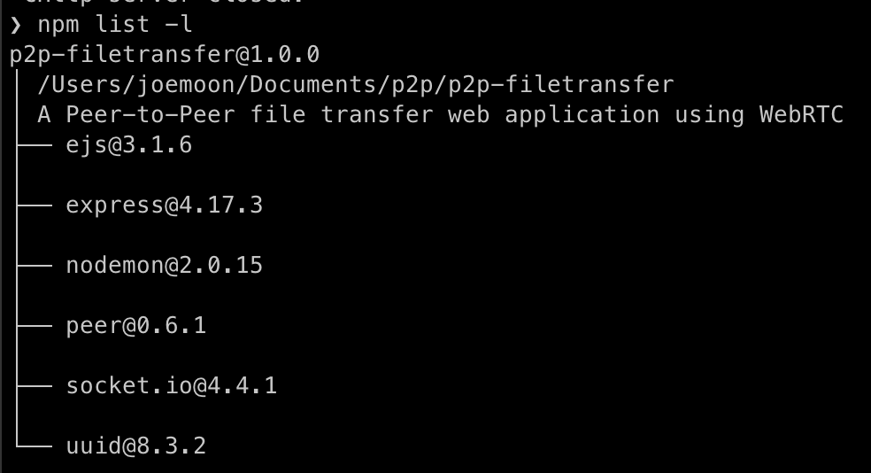

# Peer-to-Peer Distributed File Downloader

### University of Missouri - Kansas City
<ul>
    <li>Distributed Computing Systems (CS5590-0012)</li>
    <li>Spring 2022</li>
</ul>

### Contributors
<ul>
    <li>Joe Moon</li>
    <li>Olena Khrystenko</li>
    <li>Jack Zhang</li>
</ul>

### Description
The aim of this project is to create a web application that will connect clients (peers) to a peer-to-peer network for the purpose of transferring files across that network.
The principle technologies that will be used in this implementation (along with their respective APIs) are as follows:
<ul>
    <li>WebSockets (API: <a href="https://socket.io/">Socket.IO</a>)</li>
    <li>WebRTC (API: <a href="https://peerjs.com/">PeerJS</a>)</li>
</ul>

### Instructions
This implementation is currently under development.  The run the application as a developer, run the following commands in a CLI within the project's root directory.
<ol>
    <li>npm install (Installs project dependencies)</li>
    <li>npm run dev (Runs the server)</li>
    <li>peerjs --port 3001 (Runs the peer API)</li>
</ol>
Note: Either run one command in the background or both in separate CLIs.
Note: You should have the dependencies shown below installed.  Use command "npm list -l" to verify.

