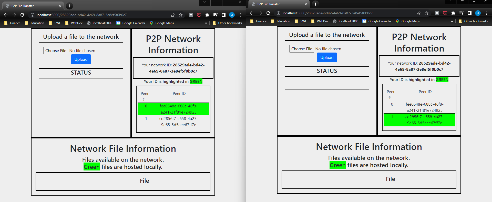

# Peer-to-Peer File Downloader

### University of Missouri - Kansas City
<ul>
    <li>Distributed Computing Systems (CS5590-0012)</li>
    <li>Spring 2022</li>
</ul>

### Contributors
<ul>
    <li>Joe Moon</li>
    <li>Olena Khrystenko</li>
    <li>Jack Zhang</li>
</ul>

### Description
The aim of this project is to create a web application that will connect clients (peers) to a peer-to-peer (P2P) network for the purpose of transferring files across that network.
The principle technologies that will be used in this implementation (along with their respective APIs) are as follows:
<ul>
    <li>WebSockets (API: <a href="https://socket.io/">Socket.IO</a>)</li>
    <li>WebRTC (API: <a href="https://peerjs.com/">PeerJS</a>)</li>
</ul>

### Instructions
The application currently only operates in a local environment but it demonstrates the P2P functionality of the project.
To run the application locally, execute the following commands in a Command Line Interface within the project's root directory.

<ol>
    <li>npm install            --> Installs project dependencies</li>
    <li>npm run dev            --> Runs the server on PORT 3000</li>
    <li>peerjs --port 3001     --> Runs the PeerJS API on PORT 3001</li>
</ol>
Note: Either run one command in the background or both in separate CLIs. 
Note: The output shown below is observed when executing the command "npm list -l".

 
After successfully executing the commands listed above, open a browser window and go to the following address to initiate the application: <a href="http://localhost:3000" target="_blank">http://localhost:3000</a>

### Application Operation
#### Joining Peers to the Network
After opening the address <a href="http://localhost:3000" target="_blank">http://localhost:3000</a>, the following user interface will appear.

 
Additional peers can join the network by copy & pasting the address with the matching network ID which is located after the "localhost:3000/" segment.  In the example below, the network ID is "28529ade-bd42-4e69-8a87-3e8ef5f0b0c7".

 
When a second browser window's address is the same as the first, the peer will be added to the network.  This addition will be reflected in the "P2P Network Information" section. 
 
Note that the peer's own address is highlighted in green.

 
This action may be repeated multiple times to add the desired number of peers to the network.

#### Uploading a File
The follow steps are done to upload a file from a peer's interface:
<ol>
    <li>Click the "Choose File" button and select a file to upload</li>
    <li>Click the "Upload" button on the peer interface</li>
</ol>
The uploaded file will appear in the "Network File Information" section.  The peer that uploaded the file will have it highlighted green with the option to remove it from the network (as shown on the left in the demonstration). 
The uploaded file will appear without any highlights on the interfaces for all other peers on the network with the option to download the file if they choose. 

 

#### Downloading a File
For a peer to download a file from another peer, simply click on the "Download" button next to the file name in the "Network File Information" section.  The download will begin automatically and be saved on the peer's local disk. 
The "Status" section will summarize the action performed, specifically which file was downloaded and from what peer.

 

